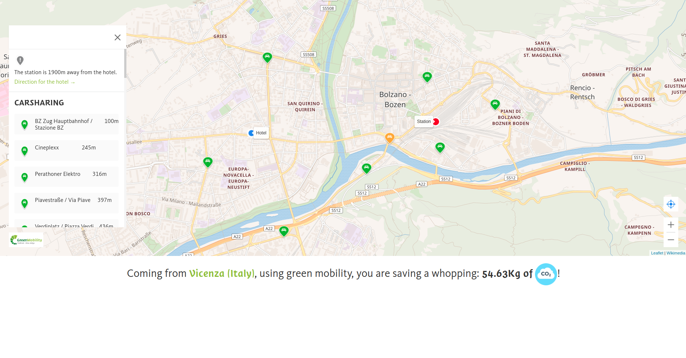

# Mobility E-Charging Map

This project contains the map web component for the [Green Mobility South Tyrol](https://www.greenmobility.bz.it/) project.

## Why

[Greenmobility](https://www.greenmobility.bz.it/it/) wants to split the existing functionalities of the website into reusable and independent components. Using these webcomponents, a developer can easily integrate the functionality of the single components into any website.
The data source for the components is the [Open Data Hub](https://opendatahub.bz.it/) project.

## Choices

To create more structured and mantainable webcomponents we used [Polymer](https://www.polymer-project.org/), more specifically the [lit-element](https://lit-element.polymer-project.org/) implementation.

CSS styles are transpiled using [Sass](https://sass-lang.com/).

We are usign [Webpack](https://webpack.js.org/) to create the bundles.

## Getting Started

### Prerequisites

To work on the project, you'll need global installations of:

- Node (v11.9.0)
- Yarn (v1.15.2)

Later versions of the same tools should also work.

### Installing

A step by step series of examples that tell you how to get a development env running

Install yarn project's dependencies

```
yarn
```

### Developement

```
yarn start
```

This will watch the files in every package configured in the right way to create a Webpack bundle.

### Production

Build all widgets using Webpack's `production` config:

```
yarn build
```

The destination for the resulting code will be the `dist` folder, located at the root of the project.

This will serve the "work in progress" website at [http://0.0.0.0:8000/](http://0.0.0.0:8000/).

## Deployment

To deploy the webcomponents, take the production bundle created with the `yarn build` command and use it as a normal javascrip script.

We suggest deploying them on a CDN, rather than hardcoding them inside a project, so that future fixes and enhancements of the webcomponents are more easily distributed.

## Running the tests

TODO

### Break down into end to end tests

TODO

### And coding style tests

TODO

## Contributing

See 

## Screenshots



## Authors

See 

## License

See 